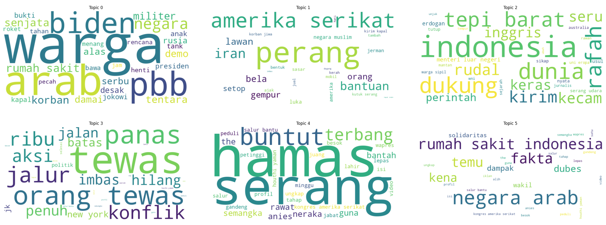

# 🇵🇸 Narasipal: Dataset of Indonesian News Headlines on the Palestinian Genocide
Narasipal is a dataset of Indonesian news headlines from 6 major news outlets, collected for the author's undergraduate thesis project entitled **Frame Analysis and Classification of Indonesian Media News Titles on the Palestinian Genocide using Latent Dirichlet Allocation (LDA) and Deep Learning**, and intended for public use.

## Overview
- 🗓: 7 October 2023 - 19 January 2025
- 📰: Kompas, Detik, Republika, Tempo, CNN Indonesia, and CNBC Indonesia
- 📂: 23.384 titles

| Outlet          | Number of Titles |
|-----------------|------------------|
| Kompas          | 6,043            |
| Tempo           | 3,431            |
| Detik           | 5,233            |
| Republika       | 2,378            |
| CNN Indonesia   | 3,745            |
| CNBC Indonesia  | 2,554            |

## Data Attributes
- ```judul_berita```
- ```sumber_berita```
- ```url```
- ```tanggal_publikasi```

## Word Cloud of LDA Results (6 topics)
A filtered subset of data (containing more than or equal to 9 words) was used as input for topic modeling using Latent Dirichlet Allocation (LDA) with a coherence score of 0.508.


 
